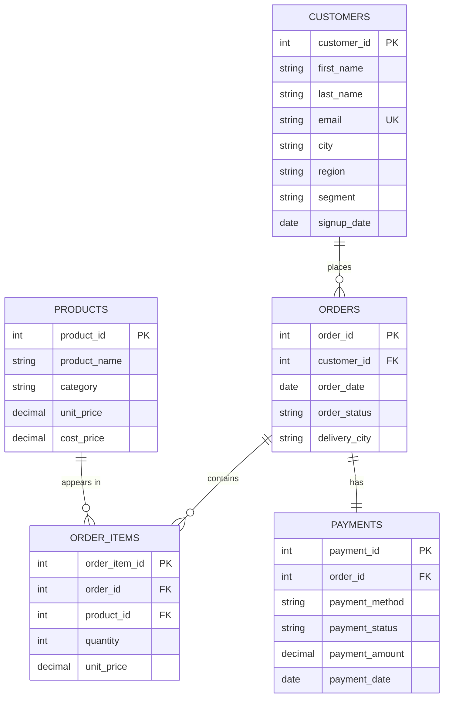

# Assignment: Part 4: SQL Relational Database and Analytical Queries

**Student Name:** Aadhish Dhamnikar  
**Student ID:** 2602015

---

# Project Overview

This project demonstrates the design and implementation of an E-commerce database using PostgreSQL. The database stores information related to customers, products, orders, order items, and payments. It also includes SQL queries to perform business analysis and generate useful insights.

The project covers:

- Database Design
- Table Creation
- Data Insertion
- SQL Queries
- Business Analysis
- Business Insights

---

# Project Structure

```
aadhishdhamnikar_2602015_part4_sql_business_analysis/

│
├── README.md
│
├── schema/
│   ├── create_tables.sql
│   └── erd.png
│
├── data/
│   └── insert_data.sql
│
├── queries/
│   ├── 01_basic_select.sql
│   ├── 02_filtering_and_case.sql
│   ├── 03_aggregations.sql
│   ├── 04_joins.sql
│   ├── 05_subqueries.sql
│   └── 06_business_insights.sql
│
└── outputs/
    └── screenshots/
```

---

# Database Tables

The project contains five tables.

## 1. Customers

Stores customer details.

Attributes:

- Customer ID
- First Name
- Last Name
- Email
- City
- Region
- Customer Segment
- Signup Date

---

## 2. Products

Stores product information.

Attributes:

- Product ID
- Product Name
- Category
- Unit Price
- Cost Price

---

## 3. Orders

Stores order details.

Attributes:

- Order ID
- Customer ID
- Order Date
- Order Status
- Delivery City

---

## 4. Order Items

Stores individual products included in each order.

Attributes:

- Order Item ID
- Order ID
- Product ID
- Quantity
- Unit Price

---

## 5. Payments

Stores payment information.

Attributes:

- Payment ID
- Order ID
- Payment Method
- Payment Status
- Payment Amount
- Payment Date

---

# Relationships

Customers (1) -------- (M) Orders

Orders (1) -------- (M) Order Items

Products (1) -------- (M) Order Items

Orders (1) -------- (1) Payments

---

# Entity Relationship Diagram (ERD)



---

# Constraints Used

The database uses the following constraints:

- Primary Keys
- Foreign Keys
- NOT NULL
- CHECK Constraints
- UNIQUE Constraint (Email)

---

# Sample Data

The database contains:

| Table       | Records |
| ----------- | ------- |
| Customers   | 20      |
| Products    | 21      |
| Orders      | 50      |
| Order Items | 82      |
| Payments    | 50      |

The dataset includes:

- Successful Payments
- Failed Payments
- Cancelled Orders
- Returned Orders
- Products Never Ordered
- Products Sold at Loss (edge case for data validation)
- Customers Without Orders
- Multiple Regions
- Multiple Product Categories

---

# SQL Topics Covered

The project demonstrates:

- SELECT
- WHERE
- ORDER BY
- DISTINCT
- LIMIT
- BETWEEN
- LIKE
- IN
- CASE
- Aggregate Functions
- GROUP BY
- HAVING
- INNER JOIN
- LEFT JOIN
- Subqueries
- EXISTS
- NOT EXISTS
- Business Analytics Queries

---

# Business Insights Generated

The project includes SQL queries to generate:

- Top Customers
- Top Selling Products
- Least Selling Products
- Monthly Revenue
- Revenue by Category
- Revenue by Region
- Customer Lifetime Value
- Average Order Value
- Gross Profit Analysis
- Failed Payment Analysis
- Executive Dashboard KPIs

---

# Business Insights Based on SQL Output

Based on the analysis performed by the queries in `06_business_insights.sql`, the following key insights can be derived:

## Insight 1: Customer Segmentation and Revenue Concentration

The database identifies top 5 customers by revenue (Q1). This reveals that revenue is often concentrated among a smaller set of high-value customers. The analysis shows which customer segments (Regular, Premium, Corporate) contribute most to overall revenue, enabling targeted retention strategies for high-value customers.

**SQL Query:** Query Q1 in 06_business_insights.sql
**Business Action:** Focus marketing and customer service efforts on top revenue-generating customers to maximize customer lifetime value.

---

## Insight 2: Product Performance and Inventory Management

Query Q2 identifies the top 5 best-selling products by quantity sold and revenue. Combined with Q3 (least selling products), this analysis identifies slow-moving inventory that may require promotional efforts or discontinuation.

**SQL Query:** Queries Q2 and Q3 in 06_business_insights.sql
**Business Action:** Create targeted promotions for underperforming products and optimize inventory levels based on sales velocity to reduce carrying costs.

---

## Insight 3: Seasonal and Monthly Revenue Trends

Query Q4 tracks monthly revenue trends over time, revealing seasonal patterns and business performance cycles. This helps forecast demand and optimize resource allocation for different seasons.

**SQL Query:** Query Q4 in 06_business_insights.sql
**Business Action:** Plan inventory, staffing, and marketing budgets based on identified seasonal trends to maximize revenue during peak periods.

---

## Insight 4: Profitability Analysis by Product Category

Queries Q5 and Q6 analyze revenue and gross profit by product category. By comparing unit price with cost price, the analysis reveals which categories are most profitable.

**SQL Query:** Queries Q5 and Q6 in 06_business_insights.sql
**Business Action:** Allocate marketing budget and shelf space to high-margin categories while finding ways to improve margins in low-profit categories.

---

## Insight 5: Customer Repeat Purchase Behavior

Query Q9 identifies repeat customers (those with multiple orders), while Q8 calculates Customer Lifetime Value (CLV). This helps distinguish between one-time buyers and loyal customers.

**SQL Query:** Queries Q8 and Q9 in 06_business_insights.sql
**Business Action:** Implement loyalty programs and retention initiatives targeting customers with high repeat purchase potential to increase CLV.

---

## Insight 6: Payment Method and Failure Analysis

Query Q10 analyzes failed payments by payment method, identifying which payment methods have higher failure rates. This is critical for reducing transaction failures and improving customer experience.

**SQL Query:** Query Q10 in 06_business_insights.sql
**Business Action:** Investigate high-failure payment methods, improve their integration, or provide alternative payment options to reduce checkout abandonment.

---

## Insight 7: Regional Sales Performance

Query Q11 compares sales performance across different regions (North, South, East, West, Central). This reveals geographical opportunities and areas needing improvement.

**SQL Query:** Query Q11 in 06_business_insights.sql
**Business Action:** Tailor marketing strategies and logistics by region based on performance data. Increase presence in high-performing regions and develop strategies to grow underperforming regions.

---

# Assumptions Made

The following assumptions were made while creating the database:

1. One payment belongs to one order (1:1 relationship enforced with UNIQUE constraint on order_id in payments table).

2. Every order belongs to one customer (enforced through customer_id foreign key).

3. Products may appear in multiple orders (enforced through order_items junction table).

4. Customers can place multiple orders (1:M relationship between customers and orders).

5. Returned and cancelled orders are stored using Order Status field (not deleted from database).

6. Payment status is either 'Successful' or 'Failed' (enforced with CHECK constraint).

7. Product prices remain constant for the sample dataset (historical pricing stored in order_items).

8. Customers without orders represent valid business scenarios (e.g., inactive customers, sign-ups not yet converted).

9. Failed payments do not block order processing; orders remain in system regardless of payment outcome.

10. Delivery city may differ from customer's registered city (allowing for shipment to different addresses).

11. Only successful payments contribute to revenue calculations (failed payments excluded from financial reports).

12. Order date, payment date, and signup date may span multiple years for realistic trend analysis.

13. Each region contains multiple cities; not all cities have all customer segments represented.

---

# Software Used

- PostgreSQL 16 (Homebrew)
- psql (PostgreSQL Command-Line Client)
- Bash (Shell Script Runner)

---

# How to Run

## Prerequisites

- PostgreSQL installed (via Homebrew on macOS: `brew install postgresql@16`)
- PostgreSQL service running (`brew services start postgresql@16`)

## Setup Steps

**Step 1: Create the database**

```bash
createdb -U "$(whoami)" ecommerce
```

**Step 2: Load the schema**

```bash
psql -U "$(whoami)" -d ecommerce -f schema/create_tables.sql
```

**Step 3: Insert sample data**

```bash
psql -U "$(whoami)" -d ecommerce -f data/insert_data.sql
```

**Step 4: Run all queries at once**

Use the provided shell script:

```bash
./run_queries.sh
```

**Step 5: Run individual queries (Optional)**

Execute specific query files with psql:

```bash
psql -U "$(whoami)" -d ecommerce -f queries/01_basic_select.sql
psql -U "$(whoami)" -d ecommerce -f queries/02_filtering_and_case.sql
psql -U "$(whoami)" -d ecommerce -f queries/03_aggregations.sql
psql -U "$(whoami)" -d ecommerce -f queries/04_joins.sql
psql -U "$(whoami)" -d ecommerce -f queries/05_subqueries.sql
psql -U "$(whoami)" -d ecommerce -f queries/06_business_insights.sql
```

**Step 6: Interactive queries (Optional)**

Connect to the database interactively:

```bash
psql -U "$(whoami)" -d ecommerce
```

---

# Query Files Description

## 01_basic_select.sql

Covers fundamental SQL SELECT queries including:

- Retrieving all records from tables (Q1-Q6)
- Sorting data with ORDER BY (Q7-Q8)
- Limiting results with LIMIT (Q9)
- Using DISTINCT to find unique values (Q10-Q11)
- Selecting specific columns (Q12+)

**Concepts Demonstrated:** SELECT, WHERE, ORDER BY, DISTINCT, LIMIT

---

## 02_filtering_and_case.sql

Demonstrates filtering techniques and conditional logic:

- Filtering by specific regions and cities (Q1, Q5)
- Using BETWEEN for range queries (Q2-Q4)
- Using IN operator for multiple values (Q5-Q6)
- Pattern matching with LIKE and ILIKE (Q7-Q9)
- String concatenation for formatted output (Q11)
- CASE statements for categorization (Q12+)
- Data validation: Finding products sold at loss (Q7) - demonstrates anomaly detection

**Concepts Demonstrated:** WHERE, BETWEEN, IN, LIKE, ILIKE, CASE, String Concatenation, Data Validation

---

## 03_aggregations.sql

Focuses on aggregate functions and GROUP BY analysis:

- Aggregate functions: COUNT, SUM, AVG, MAX, MIN (Q1-Q7)
- Grouping results by single columns (Q8-Q10)
- Grouping with multiple columns for detailed analysis (Q11+)
- Using ORDER BY with aggregates for ranking

**Concepts Demonstrated:** COUNT, SUM, AVG, MAX, MIN, GROUP BY, HAVING

---

## 04_joins.sql

Demonstrates various JOIN operations across multiple tables:

- INNER JOIN for combining related records (Q1-Q4)
- LEFT JOIN for finding unmatched records (Q5-Q6)
- Multi-table joins for comprehensive reporting (Q4)
- Calculating totals from joined tables (Q7+)

**Concepts Demonstrated:** INNER JOIN, LEFT JOIN, Multiple JOINs, ON conditions

---

## 05_subqueries.sql

Illustrates subquery techniques for complex queries:

- Scalar subqueries for comparisons (Q1)
- Nested subqueries in WHERE clause (Q2)
- Subqueries with IN/NOT IN (Q3-Q4)
- Derived tables for intermediate calculations (Q5)
- Nested subqueries for multi-level filtering (Q6)
- ALL/ANY operators for group comparisons (Q7)
- EXISTS/NOT EXISTS for existence checks (Q8+)

**Concepts Demonstrated:** Subqueries, Derived Tables, IN/NOT IN, EXISTS/NOT EXISTS, ALL/ANY

---

## 06_business_insights.sql

Advanced business analytics queries for actionable insights:

- **Q1-Q3:** Customer and Product Performance (top/least selling)
- **Q4-Q5:** Revenue Analysis by time and category
- **Q6:** Profitability Analysis (cost vs. price)
- **Q7-Q9:** Customer Analytics (AOV, CLV, repeat customers)
- **Q10-Q14:** Operational Insights (payment failures, regional sales, segment analysis)

**Concepts Demonstrated:** Window Functions, Advanced Aggregations, Business Metrics

---

# Screenshots of Query Outputs

Query output screenshots are located in the `outputs/screenshots/` directory:

- Query results demonstrating each of the 6 SQL files
- Sample data visualization of joins and aggregations
- Business insights dashboards

To view results, execute the queries as described in the "How to Run" section.

---

# Business Insights Based on SQL Output

---

# Learning Outcomes

Through this project, the following concepts were implemented:

- Relational Database Design
- Data Normalization
- SQL Programming
- Business Reporting
- Aggregate Analysis
- Multi-table Joins
- Subqueries
- Business Intelligence using SQL

---

# Conclusion

This project demonstrates how SQL can be used to design an E-commerce database, manage transactional data, and generate valuable business insights. The database follows relational database principles and uses PostgreSQL features such as constraints, joins, aggregate functions, and subqueries to support business decision-making.

---

**Submitted By**

**Name:** Aadhish Dhamnikar

**Student ID:** 2602015
